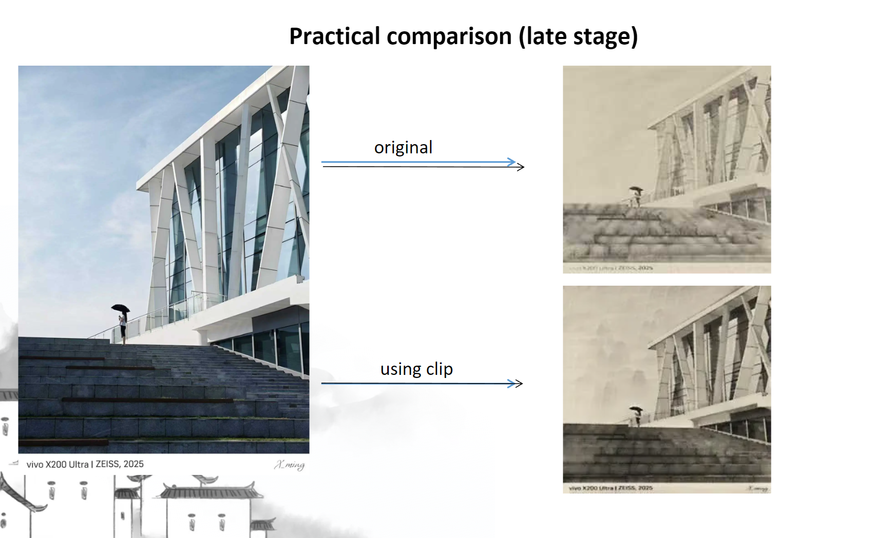
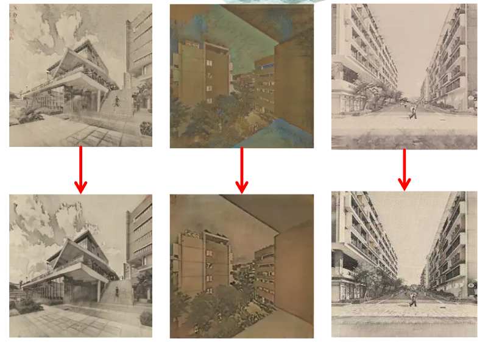
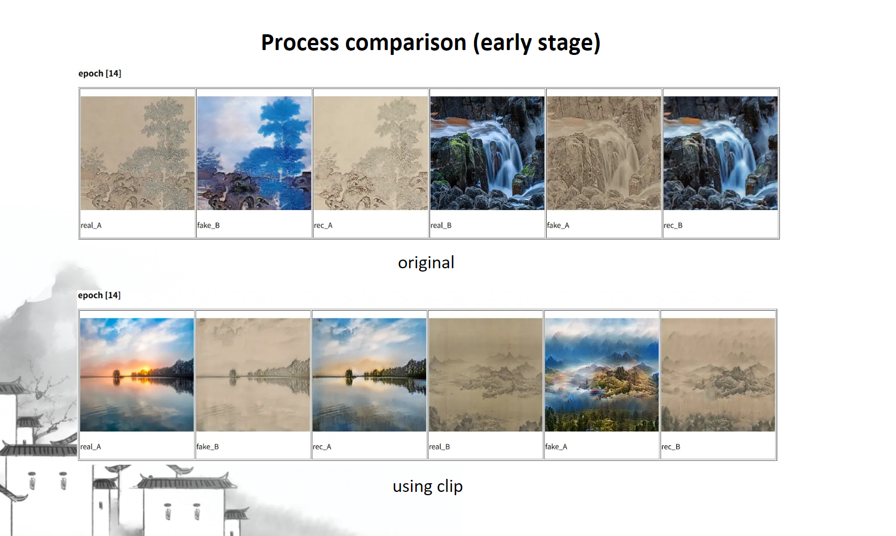
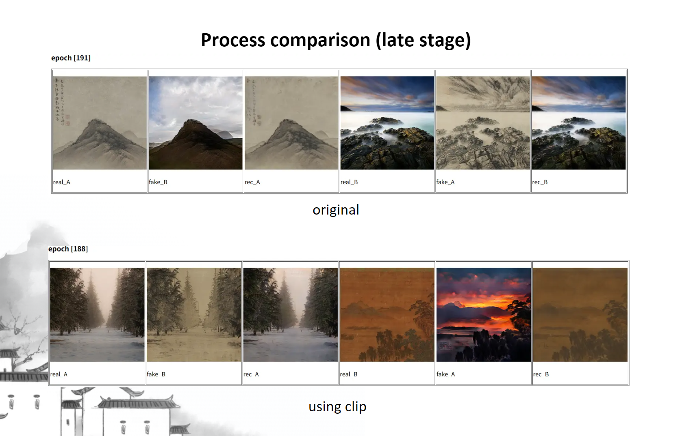
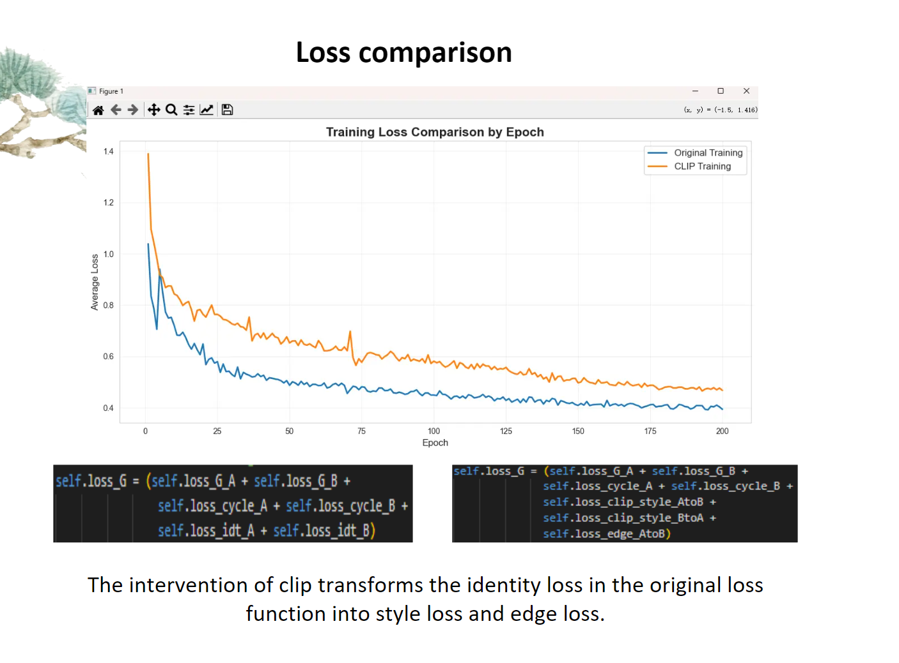

# Chinese Ink Style Transformer based on CycleGAN & CLIP

这是一个基于 **CycleGAN** 的风格迁移项目，旨在将自然风景照片转换为**中国水墨画风格**。

本项目在传统的 CycleGAN 架构基础上进行了创新，引入了 **CLIP (Contrastive Language-Image Pre-training)** 作为语义损失函数的一部分。这一改进显著提升了模型的训练效率和生成质量，并赋予了模型更强的语义扩展性。

## ✨ 主要特性 (Key Features)

- **CLIP 语义一致性**: 不同于传统的 CycleGAN 仅依赖对抗损失和循环一致性损失，本项目利用 CLIP 强大的图文匹配能力，将自然语言描述引入损失计算。
- **训练效率提升**: CLIP 提供的语义监督加速了收敛过程。
- **更好的还原度**: 生成的图片在保留原图结构和语义信息方面表现更佳，减少了伪影。
- **高扩展性**: 通过更改 CLIP 的提示词 (Prompt)，可以轻松调整生成风格的语义倾向，无需大幅修改模型结构。
- **Web 交互界面**: 提供简易的前端应用，可直接在浏览器中上传图片并查看转换效果。

## 🖼️ 效果展示 (Results)

我们对比了原始 CycleGAN 与添加 CLIP 语义损失后的模型效果。

### 1. 风格迁移概览
无论是现代建筑还是自然景观，模型都能很好地捕捉水墨画的笔触和意境。




### 2. 实际效果对比 (Practical Comparison)
在训练后期，使用 CLIP 的模型在细节纹理和整体风格统一性上明显优于原始方法。



### 3. 训练过程对比 (Process Comparison)

#### 早期阶段 (Early Stage - Epoch 14)
在训练早期，引入 CLIP 的模型已经开始展现出更清晰的轮廓和更准确的色彩分布。



#### 后期阶段 (Late Stage - Epoch 188-191)
随着训练深入，基准模型（Original）容易出现模糊或颜色失真，而使用 CLIP 的模型生成的图像更加清晰、具有艺术感。



#### 数据可视化-损失函数 (Data Visualization - Loss Function)
待分析




## 💻 Web 前端演示 (Web Demo)

本项目提供了一个基于 Web 的图形界面，方便用户上传自己的图片进行风格转换。

### 启动方式
在终端中直接运行 `app.py` 即可启动服务：

```bash
python app.py
```

启动后，请在浏览器中访问终端输出的本地地址（通常为 `http://127.0.0.1:5000`），即可上传图片并实时查看转换后的水墨画效果。

## 🛠️ 快速开始 (Getting Started)

### 依赖安装 (Prerequisites)
- Python 3.x
- PyTorch
- CLIP (OpenAI)
- Flask (用于 Web 前端)
- 其他依赖请参考 `environment.yml` 或 `requirements.txt`

```bash
pip install -r requirements.txt
# 或者使用 conda
conda env create -f environment.yml
```

### 训练 (Training)

使用 `train.py` 脚本启动训练。

```bash
# 训练基础模型
python train.py --dataroot ./datasets/your_dataset --name experiment_name --model cycle_gan

# 启用 CLIP 损失进行训练 (根据实际参数调整)
python train.py --dataroot ./datasets/your_dataset --name experiment_clip --model cycle_gan --use_clip_loss
```

## 📂 数据集 (Dataset)

请按照以下结构组织您的数据集：
```
datasets/
    your_dataset/
        trainA/  # 自然风景图片
        trainB/  # 水墨画图片
        testA/
        testB/
```

## 🙏 致谢 (Acknowledgements)

本项目代码基于 [pytorch-CycleGAN-and-pix2pix](https://github.com/junyanz/pytorch-CycleGAN-and-pix2pix) 开发，感谢原作者的开源贡献。
同时也感谢 OpenAI 开源的 CLIP 模型为本项目提供了核心的语义指导能力。
